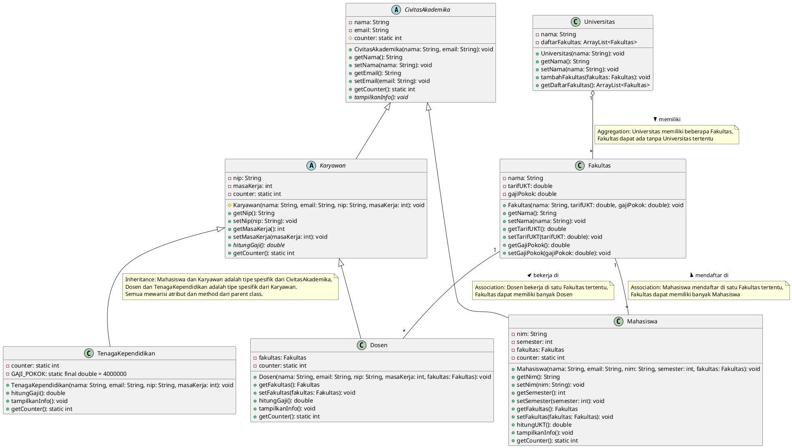

# Solusi Kasus Sistem Universitas

Berikut ini solusi lengkap untuk kasus sistem universitas sesuai dengan perintah yang diberikan.

## 1. Class Diagram (PlantUML)



## 2. Implementasi Java

### CivitasAkademika.java

```java
public abstract class CivitasAkademika {
    private String nama;
    private String email;
    protected static int counter = 0; // Counter untuk menghitung jumlah instance

    protected CivitasAkademika(String nama, String email) {
        this.nama = nama;
        this.email = email;
        counter++; // Menambah counter setiap kali instance dibuat
    }

    public String getNama() {
        return nama;
    }

    public void setNama(String nama) {
        this.nama = nama;
    }

    public String getEmail() {
        return email;
    }

    public void setEmail(String email) {
        this.email = email;
    }

    public static int getCounter() {
        return counter;
    }

    // Method abstract yang akan diimplementasikan di subclass
    public abstract void tampilkanInfo();
}
```

### Universitas.java

```java
import java.util.ArrayList;

public class Universitas {
    private String nama;
    private ArrayList<Fakultas> daftarFakultas;

    public Universitas(String nama) {
        this.nama = nama;
        this.daftarFakultas = new ArrayList<>(); // Inisialisasi list fakultas
    }

    public String getNama() {
        return nama;
    }

    public void setNama(String nama) {
        this.nama = nama;
    }

    // Method untuk menambahkan fakultas ke universitas
    public void tambahFakultas(Fakultas fakultas) {
        daftarFakultas.add(fakultas);
    }

    public ArrayList<Fakultas> getDaftarFakultas() {
        return daftarFakultas;
    }
}
```

### Fakultas.java

```java
public class Fakultas {
    private String nama;
    private double tarifUKT;
    private double gajiPokok;

    public Fakultas(String nama, double tarifUKT, double gajiPokok) {
        this.nama = nama;
        this.tarifUKT = tarifUKT;
        this.gajiPokok = gajiPokok;
    }

    public String getNama() {
        return nama;
    }

    public void setNama(String nama) {
        this.nama = nama;
    }

    public double getTarifUKT() {
        return tarifUKT;
    }

    public void setTarifUKT(double tarifUKT) {
        this.tarifUKT = tarifUKT;
    }

    public double getGajiPokok() {
        return gajiPokok;
    }

    public void setGajiPokok(double gajiPokok) {
        this.gajiPokok = gajiPokok;
    }
}
```

### Mahasiswa.java

```java
public class Mahasiswa extends CivitasAkademika {
    private String nim;
    private int semester;
    private Fakultas fakultas;
    private static int counter = 0; // Counter khusus untuk mahasiswa

    public Mahasiswa(String nama, String email, String nim, int semester, Fakultas fakultas) {
        super(nama, email); // Memanggil konstruktor parent class
        this.nim = nim;
        this.semester = semester;
        this.fakultas = fakultas;
        counter++; // Menambah counter mahasiswa
    }

    public String getNim() {
        return nim;
    }

    public void setNim(String nim) {
        this.nim = nim;
    }

    public int getSemester() {
        return semester;
    }

    public void setSemester(int semester) {
        this.semester = semester;
    }

    public Fakultas getFakultas() {
        return fakultas;
    }

    public void setFakultas(Fakultas fakultas) {
        this.fakultas = fakultas;
    }

    // Method untuk menghitung UKT dengan pengurangan 5% per semester
    public double hitungUKT() {
        // UKT berkurang 5% setiap semesternya
        double potongan = (semester - 1) * 0.05;
        // Pastikan potongan tidak melebihi 100%
        potongan = Math.min(potongan, 1.0);
        return fakultas.getTarifUKT() * (1 - potongan);
    }

    // Override method dari class parent
    @Override
    public void tampilkanInfo() {
        System.out.println("=== Informasi Mahasiswa ===");
        System.out.println("Nama: " + getNama());
        System.out.println("Email: " + getEmail());
        System.out.println("NIM: " + nim);
        System.out.println("Semester: " + semester);
        System.out.println("Fakultas: " + fakultas.getNama());
        System.out.println("UKT: Rp" + String.format("%,.2f", hitungUKT()));
        System.out.println("=====================");
    }

    public static int getCounter() {
        return counter;
    }
}
```

### Karyawan.java

```java
public abstract class Karyawan extends CivitasAkademika {
    private String nip;
    private int masaKerja;
    private static int counter = 0; // Counter khusus untuk karyawan

    protected Karyawan(String nama, String email, String nip, int masaKerja) {
        super(nama, email); // Memanggil konstruktor parent class
        this.nip = nip;
        this.masaKerja = masaKerja;
        counter++; // Menambah counter karyawan
    }

    public String getNip() {
        return nip;
    }

    public void setNip(String nip) {
        this.nip = nip;
    }

    public int getMasaKerja() {
        return masaKerja;
    }

    public void setMasaKerja(int masaKerja) {
        this.masaKerja = masaKerja;
    }

    // Method abstract untuk menghitung gaji yang akan diimplementasikan di subclass
    public abstract double hitungGaji();

    public static int getCounter() {
        return counter;
    }
}
```

### Dosen.java

```java
public class Dosen extends Karyawan {
    private Fakultas fakultas;
    private static int counter = 0; // Counter khusus untuk dosen

    public Dosen(String nama, String email, String nip, int masaKerja, Fakultas fakultas) {
        super(nama, email, nip, masaKerja); // Memanggil konstruktor parent class
        this.fakultas = fakultas;
        counter++; // Menambah counter dosen
    }

    public Fakultas getFakultas() {
        return fakultas;
    }

    public void setFakultas(Fakultas fakultas) {
        this.fakultas = fakultas;
    }

    // Implementasi method hitungGaji untuk dosen
    @Override
    public double hitungGaji() {
        double gajiPokok = fakultas.getGajiPokok();
        // Gaji dosen = gaji pokok fakultas + (masa kerja × 1% × gaji pokok)
        return gajiPokok + (getMasaKerja() * 0.01 * gajiPokok);
    }

    // Override method dari class parent
    @Override
    public void tampilkanInfo() {
        System.out.println("=== Informasi Dosen ===");
        System.out.println("Nama: " + getNama());
        System.out.println("Email: " + getEmail());
        System.out.println("NIP: " + getNip());
        System.out.println("Masa Kerja: " + getMasaKerja() + " tahun");
        System.out.println("Fakultas: " + fakultas.getNama());
        System.out.println("Gaji: Rp" + String.format("%,.2f", hitungGaji()));
        System.out.println("=====================");
    }

    public static int getCounter() {
        return counter;
    }
}
```

### TenagaKependidikan.java

```java
public class TenagaKependidikan extends Karyawan {
    private static int counter = 0; // Counter khusus untuk tendik
    private static final double GAJI_POKOK = 4000000; // Gaji pokok tendik sesuai kasus

    public TenagaKependidikan(String nama, String email, String nip, int masaKerja) {
        super(nama, email, nip, masaKerja); // Memanggil konstruktor parent class
        counter++; // Menambah counter tendik
    }

    // Implementasi method hitungGaji untuk tendik
    @Override
    public double hitungGaji() {
        // Gaji tendik = 4.000.000 + (masa kerja × 1% × gaji pokok)
        return GAJI_POKOK + (getMasaKerja() * 0.01 * GAJI_POKOK);
    }

    // Override method dari class parent
    @Override
    public void tampilkanInfo() {
        System.out.println("=== Informasi Tenaga Kependidikan ===");
        System.out.println("Nama: " + getNama());
        System.out.println("Email: " + getEmail());
        System.out.println("NIP: " + getNip());
        System.out.println("Masa Kerja: " + getMasaKerja() + " tahun");
        System.out.println("Gaji: Rp" + String.format("%,.2f", hitungGaji()));
        System.out.println("=====================");
    }

    public static int getCounter() {
        return counter;
    }
}
```

### Main.java (Program Utama)

```java
public class Main {
    public static void main(String[] args) {
        // Membuat Universitas
        Universitas univ = new Universitas("Universitas Teknologi Indonesia");

        // Membuat Fakultas
        Fakultas fti = new Fakultas("Fakultas Teknologi Informasi", 8000000, 7000000);
        Fakultas fek = new Fakultas("Fakultas Ekonomi dan Bisnis", 7500000, 6500000);

        // Menambahkan Fakultas ke Universitas
        univ.tambahFakultas(fti);
        univ.tambahFakultas(fek);

        // Membuat Mahasiswa
        Mahasiswa mhs1 = new Mahasiswa("Budi Santoso", "budi@mail.com", "12345", 1, fti);
        Mahasiswa mhs2 = new Mahasiswa("Ani Wulandari", "ani@mail.com", "12346", 3, fek);

        // Membuat Dosen
        Dosen dsn1 = new Dosen("Dr. Ahmad", "ahmad@mail.com", "D001", 5, fti);
        Dosen dsn2 = new Dosen("Prof. Maya", "maya@mail.com", "D002", 10, fek);

        // Membuat Tenaga Kependidikan
        TenagaKependidikan tnd1 = new TenagaKependidikan("Rudi", "rudi@mail.com", "T001", 7);

        // Menampilkan informasi
        System.out.println("Informasi Civitas Akademika:");
        System.out.println("============================");

        mhs1.tampilkanInfo();
        mhs2.tampilkanInfo();
        dsn1.tampilkanInfo();
        dsn2.tampilkanInfo();
        tnd1.tampilkanInfo();

        // Menampilkan jumlah instance
        System.out.println("\nJumlah Instance:");
        System.out.println("Total Civitas Akademika: " + CivitasAkademika.getCounter());
        System.out.println("Total Mahasiswa: " + Mahasiswa.getCounter());
        System.out.println("Total Karyawan: " + Karyawan.getCounter());
        System.out.println("Total Dosen: " + Dosen.getCounter());
        System.out.println("Total Tenaga Kependidikan: " + TenagaKependidikan.getCounter());
    }
}
```

## 3. Penjelasan Konsep OOP

### Enkapsulasi

Enkapsulasi adalah konsep pembungkusan data (atribut) dan metode yang bekerja pada data tersebut menjadi satu unit dan menyembunyikan implementasinya.

**Contoh dalam kode:**

```java
// Atribut di-private dan diakses melalui getter/setter
private String nama;
private String email;

public String getNama() {
    return nama;
}

public void setNama(String nama) {
    this.nama = nama;
}
```

Pada contoh di atas, atribut `nama` dan `email` dibuat `private` dan hanya bisa diakses melalui method getter dan setter. Dengan begitu, kita dapat mengontrol akses dan manipulasi data tersebut.

### Pewarisan (Inheritance)

Pewarisan adalah konsep dimana sebuah class dapat mewarisi atribut dan method dari class lain.

**Contoh dalam kode:**

```java
public class Mahasiswa extends CivitasAkademika {
    // Mahasiswa mewarisi semua atribut dan method dari CivitasAkademika
}

public abstract class Karyawan extends CivitasAkademika {
    // Karyawan mewarisi semua atribut dan method dari CivitasAkademika
}
```

Pada contoh di atas, `Mahasiswa` dan `Karyawan` mewarisi atribut dan method dari `CivitasAkademika`, seperti `nama` dan `email`. Dengan pewarisan, kita tidak perlu menulis ulang kode yang sama di setiap class.

### Overloading

Overloading adalah konsep dimana sebuah class memiliki beberapa method dengan nama yang sama tetapi parameter yang berbeda.

**Contoh dalam kode:**
Contoh sederhana adalah jika kita menambahkan constructor kedua pada class `Fakultas`:

```java
// Constructor pertama
public Fakultas(String nama, double tarifUKT, double gajiPokok) {
    this.nama = nama;
    this.tarifUKT = tarifUKT;
    this.gajiPokok = gajiPokok;
}

// Constructor kedua (overloading)
public Fakultas(String nama) {
    this(nama, 0, 0); // Memanggil constructor pertama
}
```

### Overriding

Overriding adalah konsep dimana subclass mendefinisikan ulang method yang sudah ada di superclass-nya.

**Contoh dalam kode:**

```java
// Di class CivitasAkademika (parent)
public abstract void tampilkanInfo();

// Di class Mahasiswa (child)
@Override
public void tampilkanInfo() {
    System.out.println("=== Informasi Mahasiswa ===");
    // implementasi khusus untuk mahasiswa
}

// Di class Dosen (child dari Karyawan yang child dari CivitasAkademika)
@Override
public void tampilkanInfo() {
    System.out.println("=== Informasi Dosen ===");
    // implementasi khusus untuk dosen
}
```

Pada contoh di atas, method `tampilkanInfo()` didefinisikan sebagai abstract di class `CivitasAkademika` dan kemudian diimplementasikan secara berbeda di subclass `Mahasiswa` dan `Dosen` sesuai dengan kebutuhan masing-masing.

Contoh overriding lainnya adalah `hitungGaji()` yang diimplementasikan berbeda di class `Dosen` dan `TenagaKependidikan`.
